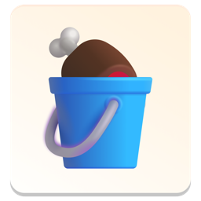

<p align="center">
</p>
<h3 align="center">Chumbucket</h3>
<p align="center">A kit to build quick demo applications and test ideas (chumming the water so to speak)</p>

---

# Get Started

run in development

```bash
flutter run -d linux
# flutter run -d macos
# flutter run -d windows
```
Press `r` in the terminal to reload in application


# Why did you make this boilerplate?

I made this for myself to help make applications that are: 
- 🎯 [SRP](https://en.wikipedia.org/wiki/Single-responsibility_principle) focused 
- 🚸 Cross platform
- 🛖 Offline first
- 🪣 Offline data sharing with TOML

More information in my blog post: [Bringing back dumb programs](https://blog.stagfoo.com/post/dumb-programs/)

# Whats inside

- 🖼️ UI = MaterialApp
- 🍹 Styles = MaterialApp
- 🍖 Store = Getx
- 🦴 Router = Getx
- 🪣 Storage = TOML


# What is a chumbucket?

A bucket for holding a form of bait used to attract sharks


